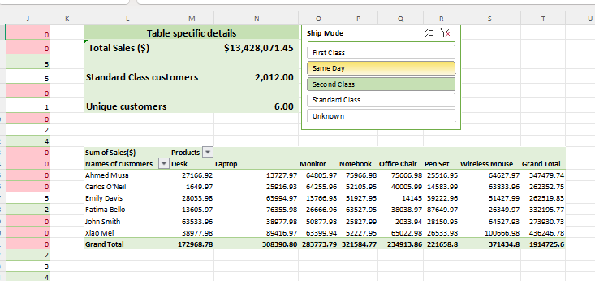

Retail Sales Dashboard - Excel

Project Overview
This project analyzes 70,000+ retail sales records to identify key business insights. The goal was to clean messy data and build an interactive dashboard to answer core business questions.

Tools Used
- Excel
- Power Query - for data cleaning and appending
- PivotTables - for data analysis
- PivotCharts & Slicers - for interactive dashboard

Key KPIs
- Total Sales: $1,342,807.50
- Standard Class Orders: 2,012
- Unique Customers: 6

Data Cleaning Steps
1. Appended `Batch 1` and `Batch 2` datasets
2. Split customer names and standardized formats
3. Converted dates to proper format
4. Removed `$` and `,` from Sales column
5. Checked for missing values

Dashboard Features 
- Interactive Slicers

Key Insights
1. Total revenue generated was $1.34M
2. Standard Class is the most used shipping mode

How to Use
1. Download the Excel file
2. Use the Slicers to filter data
3. Refresh PivotTables if data changes
